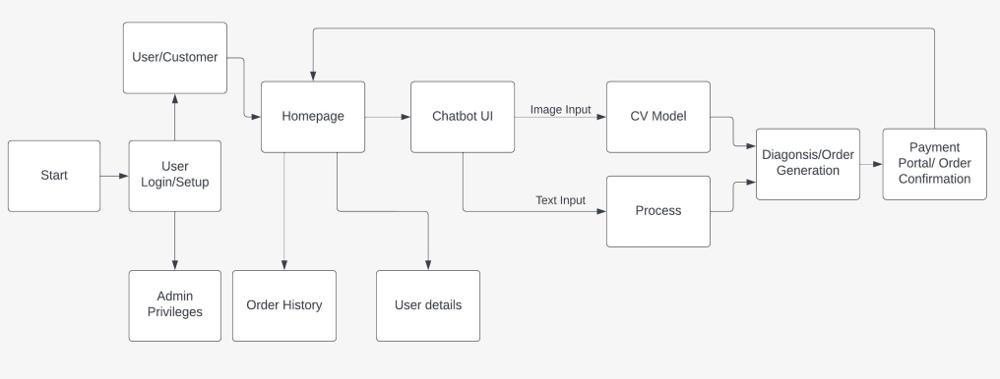
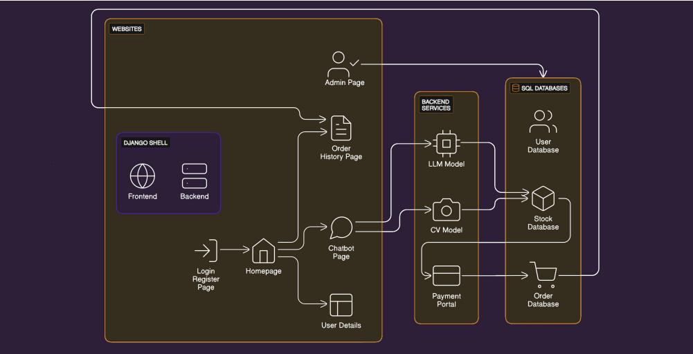

# Mediverse Chatbot

## Overview

- Traditional medicine websites can be complex, hindering user understanding. Our solution introduces a chat-based platform for a more user-friendly experience.
- Patients often have many questions about medicines and obtaining timely answers can be a lengthy process. Our project provides real-time guidance through an AI-powered chatbot.
- Incorrectly taking dosages or medications is dangerous and critical. This chatbot can offer guidance, minimizing the risk of inappropriate usage.
- Illegible doctor prescriptions create confusion among patients. A handwriting model can recognize the doctor's prescription and take orders accordingly.
- Certain medications may have adverse interactions, presenting health risks. By using the user's purchase history, the chatbot prevents complications by offering personalized recommendations.

## Modules and Technology Stack

- **User Interface Module:** Web Interface: HTML5, Css3, JavaScript
- **Input Processing Module:** NLP: Python  (NLTK, spaCy, Transformers library), Machine Learning: Python (scikit-learn, TensorFlow, PyTorch)
- **Medicine Database Module:** Database: MySQL, Backend: Node.js, Python (Django)
- **Stock Management Module:** Database: MySQL, Backend: Node.js, Python (Django)
- **Order Processing Module:** Backend: Node.js, Python (Django)
- **LLM Module**

## Work Flow

## System Design

## Use Cases and Benefits

- Efficient Prescription Processing:
The chatbot extracts releevant information from text and images, and reduces the time and effort required to do them manually. It minimizes aerorrs and ensures accurate dosage.

- User Profile:
User can check their previous orders and can request help from customer care.

- Secondary Consultant:
The chatbot can provide personalized guidance on past interactions and demographic data of user.

- Effortless Order Placement:
 The chatbot proceses payments and estimates delivery times. It simplifies the ordering process, making it convenient for users while reducing workload.

- Ease Of Management:
The various backend tools allow for easy management of the database by administrators.

## Team Member Details
Team Lead - Kanishkaran M
Team Member 1 - Jeffrey Terrance Daniel I
Team Member 2 - Shreeram T
Team Member 3 - Tharun E 

